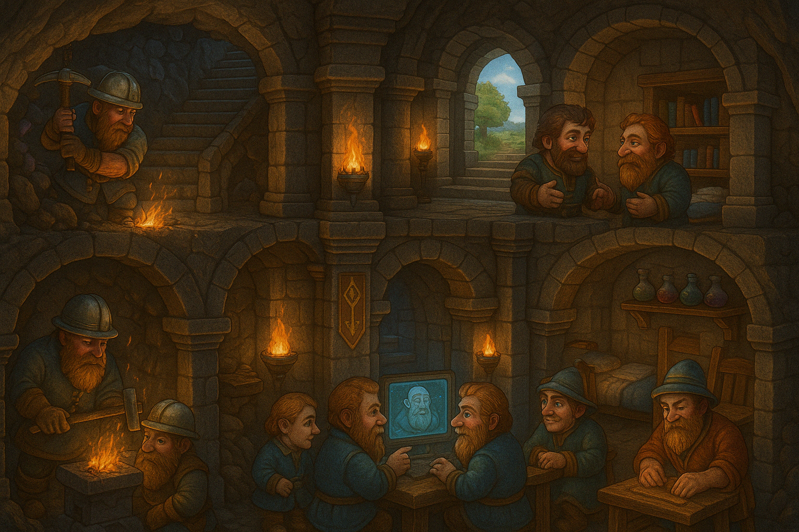
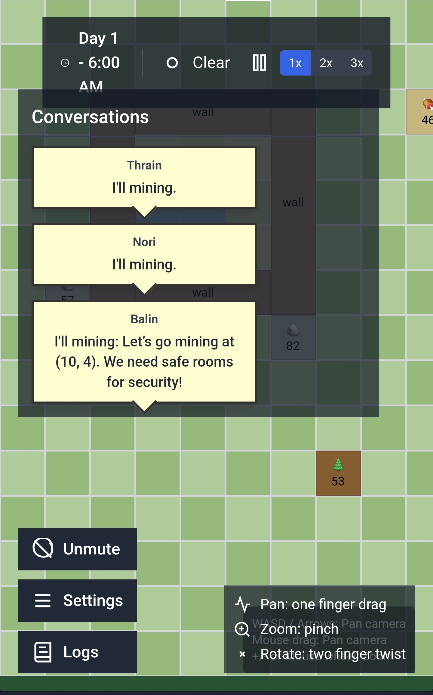

# 🏰 Dwarven Fortress Simulation 🏰

*Scribed in the ancient halls of Mount CodeRock by the master craftsdwarves of the Digital Deep*

## 📜 The Chronicles of the Deep Rock Fortress

Welcome, surface-dweller, to the sacred halls of our dwarven bastion! This tome contains the collected wisdom of generations of stout miners, craftsdwarves, and warriors who live beneath the stone.

Our kind has developed a most curious magical apparatus - a mirror into the very lives of our brethren! Through clever application of ancient enchantments (and some newfangled human technology), you may now observe and partake in the daily grind of dwarven life.

### ✨ Features Crafted with Dwarven Precision

- **Autonomous Dwarven Life**: Our dwarves think and act on their own accord through the magic of artificial intelligence!
- **Isometric Fortress View**: See our mighty halls from a proper dwarven angle!
- **Resource Management**: Watch as our industrious folk gather stone, wood, and food!
- **Building Construction**: Marvel at our architectural prowess as we construct everything from humble beds to grand workshops!
- **Dynamic Conversations**: Eavesdrop on the witty banter and deep philosophical musings of dwarves!
- **Detailed Memory System**: Dwarves remember past events, shaping their future decisions!
- **Comprehensive Logging**: All events are recorded in the annals of dwarven history!

## 🧰 The Dwarven Lifecycle

Each dwarf in the fortress is an autonomous entity with needs, desires, and skills. Through the arcane arts of artificial intelligence, they make their own decisions based on their surroundings, needs, and memories.

### 🔨 Actions Available to a Proper Dwarf

1. **Mining** (🪨): When stone is spotted, a dwarf will extract it for building materials. "The earth yields her treasures to the worthy!"

2. **Woodcutting** (🌲): Dwarves venture to forest areas to gather wood. "Aye, trees are useful, even if they block the good view of stone!"

3. **Building** (🏠): Constructing walls, floors, furniture, and workshops. "Stone upon stone, we build our legacy!"

4. **Eating** (🍖): A hungry dwarf will seek out food. "Can't mine on an empty stomach!"

5. **Sleeping** (😴): Tired dwarves rest to regain energy. "Even the stoutest beard needs rest!"

6. **Socializing** (🗣️): Dwarves converse with each other, sharing tales and building relationships. "A friend in the deep is worth two on the surface!"

7. **Crafting** (⚒️): Creating tools, weapons, and other goods at workshops. "Put hammer to anvil and magic happens!"

8. **Hauling** (🧺): Moving resources from one place to another. "Proper logistics is what separates us from the goblins!"

### 🧠 How Dwarves Decide What To Do

Each dwarf uses a sophisticated decision-making process:

1. **Critical Needs Assessment**: First, they check for urgent needs like extreme hunger, exhaustion, or loneliness

2. **World State Evaluation**: They assess available resources, building status, and the activities of other dwarves

3. **Memory Consultation**: Past experiences influence their decisions ("Remember when I built that fine chair? I should make another!")

4. **Personality Application**: Each dwarf has unique traits that affect their choices

5. **Context-Aware Decision**: Finally, they select an action that makes the most sense given all factors

The decision-making process uses AI to generate natural responses, creating unique personalities and behaviors for each dwarf!

## 🎮 How to Play

1. **Start the Game**: Run the fortress simulation and watch the magic unfold
2. **Observe Your Dwarves**: Watch as they autonomously go about their lives
3. **Check Logs**: View detailed logs of conversations, decisions, and events
4. **Adjust Game Speed**: Speed up or slow down time as desired
5. **Watch Resources**: Monitor stone, wood, and food stocks

### 🖱️ Controls

- **WASD/Arrow Keys**: Pan camera
- **+/-**: Zoom in/out
- **Click on Dwarf**: Select and view dwarf details
- **Space**: Pause/resume simulation
- **1-3**: Adjust game speed

## 📷 Dwarven Imagery

*A glimpse of dwarven conversations through a magical scrying device (mobile view)*

*The communal dining hall, where tales are told and ale is consumed*

*A bustling workshop where crafters ply their trade*

## 🔧 Technical Architecture (for Human Scribes)

### Core Systems Architecture

The Dwarven Fortress Simulation is built with a modern tech stack:

- **React + TypeScript**: Frontend interface and game rendering
- **Three.js**: 3D isometric visualization
- **Zustand**: State management for game entities
- **Express**: Backend server for AI processing and game state

### LLM Integration Architecture

The integration of Large Language Models (LLMs) is a key feature that brings dwarves to life:

#### 1. AI Conversation System
- **System**: Each dwarf has a unique system prompt defining personality, current state, and context
- **Memory**: Dwarves maintain a limited memory of recent events (conversations, actions, decisions)
- **OpenAI Integration**: Conversations use GPT models to generate contextually appropriate responses
- **Formatting**: Specialized prompt engineering to maintain character consistency

#### 2. Decision-Making Pipeline
- **Context Preparation**: Gathers dwarf state, world information, and memories
- **Critical Needs Detection**: Emergency decisions for urgent needs (extreme hunger, exhaustion)
- **AI-Driven Decisions**: Uses LLM to generate appropriate task selection
- **Action Mapping**: Converts AI text responses into game actions
- **Memory Update**: Decisions are added to the dwarf's memory

#### 3. Logging System
- **Session-Based Logging**: Each game session creates dedicated logs
- **API Request Logging**: Records all LLM requests and responses
- **Event Logging**: Tracks dwarf actions, movements, and state changes
- **Dialogue Logging**: Stores all conversations between dwarves

#### 4. Prompt Engineering Techniques
- **Character Consistency**: System prompts establish dwarf personality traits
- **Memory Integration**: Recent experiences inform current decisions
- **Context-Rich Descriptions**: Detailed world state information for better decision-making
- **Response Parsing**: Structured extraction of intent from AI-generated text

The AI system is designed to create emergent gameplay where dwarves develop relationships, preferences, and behavior patterns that evolve over time.

## 🛠️ Developer Notes

This project demonstrates the integration of generative AI in game environments to create autonomous agents with personality and memory. The architecture separates game mechanics from AI decision systems, allowing for flexible expansion of both components.

The logging system provides valuable insights for debugging, but also creates an interesting narrative record of the game world's development over time.

Future improvements could include more sophisticated dwarf relationships, complex crafting mechanics, external threats (goblins!), and deeper memory systems that influence long-term behavior patterns.

---

*"May your beard grow long and your coffers full!"* - Traditional Dwarven blessing